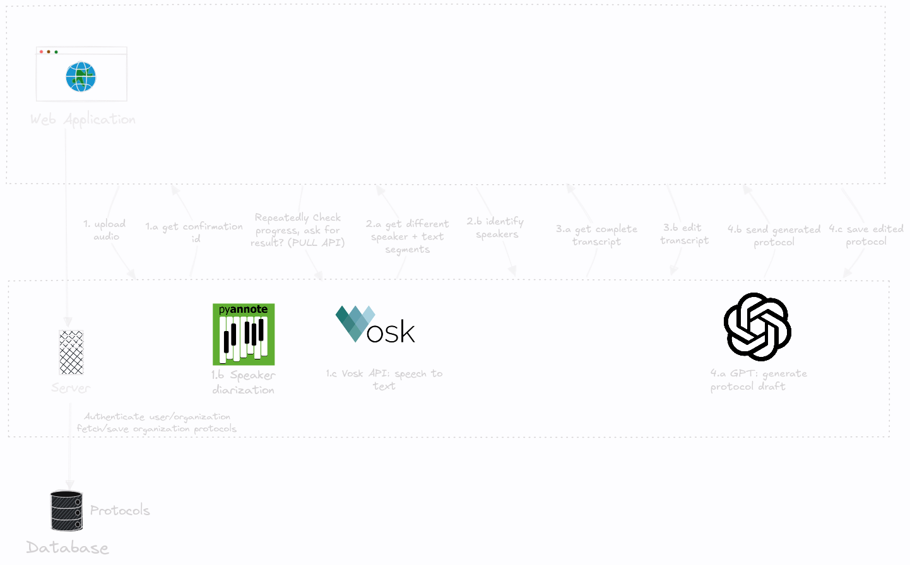

# ProtoGenFe

## 🔧 How It Works

<p align="center">
  <a href="./docs/images/protogen-detailled.png"></a>
</p>

This project was generated using [Angular CLI](https://github.com/angular/angular-cli) version 19.0.4.

## ⚡ Install & Run

After cloning the repository:

### Using Docker:

`docker-compose build    # Build the image`

`docker-compose up -d    # Start the container in detached mode`

### Development server

To start a local development server, run:

```bash
ng serve
```

Once the server is running, open your browser and navigate to `http://localhost:4200/`. The application will automatically reload whenever you modify any of the source files.

To test with backend, clone [Backend Repo](https://github.com/SoftwareEngineering-WS2025-ARMMS/GEN_AI_Protokoll.git) and run the server as described in its Readme file.

### Building

To build the project run:

```bash
ng build
```

This will compile your project and store the build artifacts in the `dist/` directory. By default, the production build optimizes your application for performance and speed.

### Running unit tests

To execute unit tests with the [Karma](https://karma-runner.github.io) test runner, use the following command:

```bash
ng test
```
