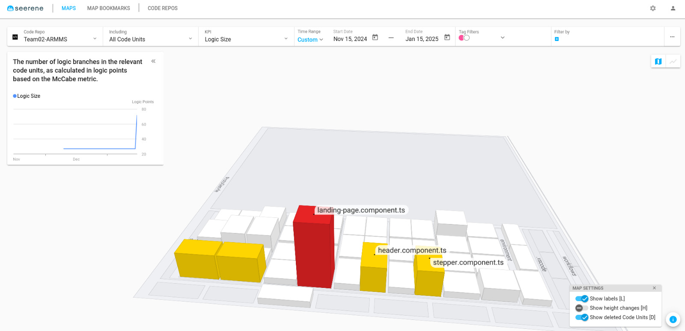
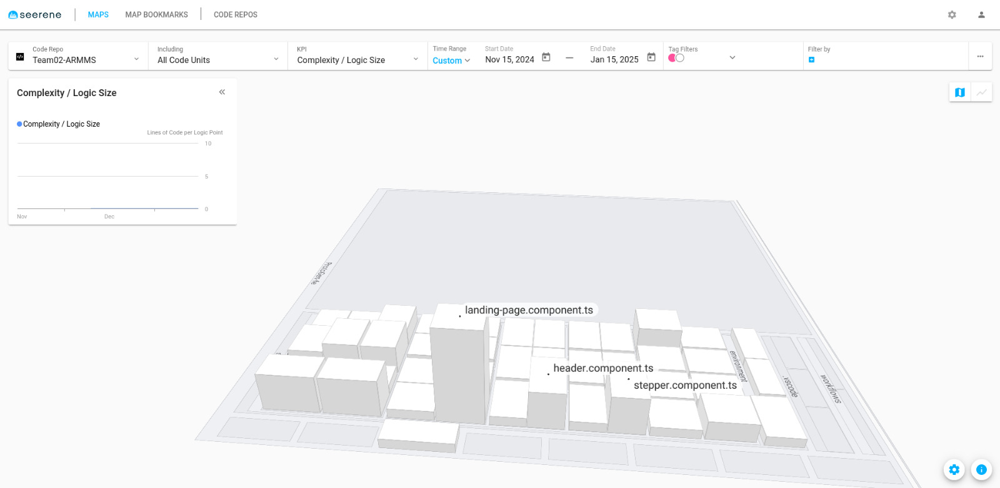

# ProtoGenFe

## 🔧 How It Works

<p align="center">
  <a href="./docs/images/protogen-detailled.png"></a>
</p>

This project was generated using [Angular CLI](https://github.com/angular/angular-cli) version 19.0.4.

## ⚡ Install & Run

After cloning the repository:

### Using Docker:

`docker-compose build    # Build the image`

`docker-compose up -d    # Start the container in detached mode`

### Development server

To start a local development server, run:

```bash
ng serve
```

Once the server is running, open your browser and navigate to `http://localhost:4200/`. The application will automatically reload whenever you modify any of the source files.

To test with backend, clone [Backend Repo](https://github.com/SoftwareEngineering-WS2025-ARMMS/GEN_AI_Protokoll.git) and run the server as described in its Readme file.

### Building

To build the project run:

```bash
ng build
```

This will compile your project and store the build artifacts in the `dist/` directory. By default, the production build optimizes your application for performance and speed.

### Running unit tests

To execute unit tests with the [Karma](https://karma-runner.github.io) test runner, use the following command:

```bash
ng test
```

## Code Quality and Analysis 🛠️

We utilized [Sereene](https://www.seerene.com/de/), a tool for automated code quality analysis and technical debt management, to check the robustness and maintainability of our codebase. Sereene helped identify potential improvements and maintain high coding standards throughout the project.

Sample final Insights from Sereene:

<a href="./docs/images/sereene-logic-size.jpeg"></a>

<a href="./docs/images/sereene-complexity-logic.jpeg"></a>

Both illustrations indicate high logic in the landing page component, which currenlty contains the protocols display, filtering and pagination features. This could be in the future simplified by having a dedicated component for protocols overview and keeping the landing page as the name suggests for just a landing page.
